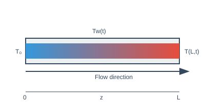
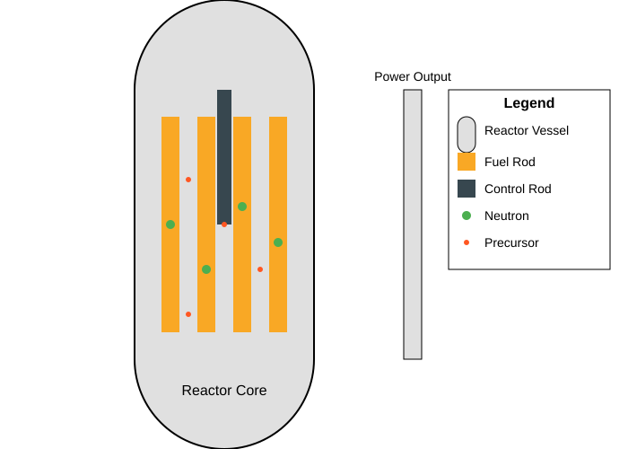

---
jupytext:
  text_representation:
    extension: .md
    format_name: myst
    format_version: 0.13
    jupytext_version: 1.16.3
kernelspec:
  display_name: Python 3
  language: python
  name: python3
---

# Example COCPs
### Heat Exchanger 

We are considering a system where fluid flows through a tube, and the goal is to control the temperature of the fluid by adjusting the temperature of the tube's wall over time. The wall temperature, denoted as $ T_w(t) $, can be changed as a function of time, but it remains the same along the length of the tube. On the other hand, the temperature of the fluid inside the tube, $ T(z, t) $, depends both on its position along the tube $ z $ and on time $ t $. It evolves according to the following partial differential equation:

$$
\frac{\partial T}{\partial t} = -v \frac{\partial T}{\partial z} + \frac{h}{\rho C_p} (T_w(t) - T)
$$

where we have:
- $ v $: the average speed of the fluid moving through the tube,
- $ h $: how easily heat transfers from the wall to the fluid,
- $ \rho $ and $ C_p $: the fluid's density and heat capacity.

This equation describes how the fluid's temperature changes as it moves along the tube and interacts with the tube's wall temperature. The fluid enters the tube with an initial temperature $ T_0 $ at the inlet (where $ z = 0 $). Our objective is to adjust the wall temperature $ T_w(t) $ so that by a specific final time $ t_f $, the fluid's temperature reaches a desired distribution $ T_s(z) $ along the length of the tube. The relationship for $ T_s(z) $ under steady-state conditions (ie. when changes over time are no longer considered), is given by:

$$
\frac{d T_s}{d z} = \frac{h}{v \rho C_p}[\theta - T_s]
$$

where $ \theta $ is a constant temperature we want to maintain at the wall. The objective is to control the wall temperature $ T_w(t) $ so that by the end of the time interval $ t_f $, the fluid temperature $ T(z, t_f) $ is as close as possible to the desired distribution $ T_s(z) $. This can be formalized by minimizing the following quantity:

$$
I = \int_0^L \left[T(z, t_f) - T_s(z)\right]^2 dz
$$

where $ L $ is the length of the tube. Additionally, we require that the wall temperature cannot exceed a maximum allowable value $ T_{\max} $:

$$
T_w(t) \leq T_{\max}
$$

### Nuclear Reactor

In a nuclear reactor, neutrons interact with fissile nuclei, causing nuclear fission. This process produces more neutrons and smaller fissile nuclei called precursors. The precursors subsequently absorb more neutrons, generating "delayed" neutrons. The kinetic energy of these products is converted into thermal energy through collisions with neighboring atoms. The reactor's power output is determined by the concentration of neutrons available for nuclear fission.

The reaction kinetics can be modeled using a system of ordinary differential equations:

\begin{align*}
\dot{x}(t) &= \frac{r(t)x(t) - \alpha x^2(t) - \beta x(t)}{\tau} + \mu y(t), & x(0) &= x_0 \\
\dot{y}(t) &= \frac{\beta x(t)}{\tau} - \mu y(t), & y(0) &= y_0
\end{align*}

where:
- $x(t)$: concentration of neutrons at time $t$
- $y(t)$: concentration of precursors at time $t$
- $t$: time
- $r(t) = r[u(t)]$: degree of change in neutron multiplication at time $t$ as a function of control rod displacement $u(t)$
- $\alpha$: reactivity coefficient
- $\beta$: fraction of delayed neutrons
- $\mu$: decay constant for precursors
- $\tau$: average time taken by a neutron to produce a neutron or precursor

The power output can be adjusted based on demand by inserting or retracting a neutron-absorbing control rod. Inserting the control rod absorbs neutrons, reducing the heat flux and power output, while retracting the rod has the opposite effect.

The objective is to change the neutron concentration $x(t)$ from an initial value $x_0$ to a stable value $x_\mathrm{f}$ at time $t_\mathrm{f}$ while minimizing the displacement of the control rod. This can be formulated as an optimal control problem, where the goal is to find the control function $u(t)$ that minimizes the objective functional:

\begin{equation*}
I = \int_0^{t_\mathrm{f}} u^2(t) \, \mathrm{d}t
\end{equation*}

subject to the final conditions:

\begin{align*}
x(t_\mathrm{f}) &= x_\mathrm{f} \\
\dot{x}(t_\mathrm{f}) &= 0
\end{align*}

and the constraint $|u(t)| \leq u_\mathrm{max}$

### Chemotherapy

Chemotherapy uses drugs to kill cancer cells. However, these drugs can also have toxic effects on healthy cells in the body. To optimize the effectiveness of chemotherapy while minimizing its side effects, we can formulate an optimal control problem. 

The drug concentration $y_1(t)$ and the number of immune cells $y_2(t)$, healthy cells $y_3(t)$, and cancer cells $y_4(t)$ in an organ at any time $t$ during chemotherapy can be modeled using a system of ordinary differential equations:

\begin{align*}
\dot{y}_1(t) &= u(t) - \gamma_6 y_1(t) \\
\dot{y}_2(t) &= \dot{y}_{2,\text{in}} + r_2 \frac{y_2(t) y_4(t)}{\beta_2 + y_4(t)} - \gamma_3 y_2(t) y_4(t) - \gamma_4 y_2(t) - \alpha_2 y_2(t) \left(1 - e^{-y_1(t) \lambda_2}\right) \\
\dot{y}_3(t) &= r_3 y_3(t) \left(1 - \beta_3 y_3(t)\right) - \gamma_5 y_3(t) y_4(t) - \alpha_3 y_3(t) \left(1 - e^{-y_1(t) \lambda_3}\right) \\
\dot{y}_4(t) &= r_1 y_4(t) \left(1 - \beta_1 y_4(t)\right) - \gamma_1 y_3(t) y_4(t) - \gamma_2 y_2(t) y_4(t) - \alpha_1 y_4(t) \left(1 - e^{-y_1(t) \lambda_1}\right)
\end{align*}

where:
- $y_1(t)$: drug concentration in the organ at time $t$
- $y_2(t)$: number of immune cells in the organ at time $t$
- $y_3(t)$: number of healthy cells in the organ at time $t$
- $y_4(t)$: number of cancer cells in the organ at time $t$
- $\dot{y}_{2,\text{in}}$: constant rate of immune cells entering the organ to fight cancer cells
- $u(t)$: rate of drug injection into the organ at time $t$
- $r_i, \beta_i$: constants in the growth terms
- $\alpha_i, \lambda_i$: constants in the decay terms due to the action of the drug
- $\gamma_i$: constants in the remaining decay terms

The objective is to minimize the number of cancer cells $y_4(t)$ in a specified time $t_\mathrm{f}$ while using the minimum amount of drug to reduce its toxic effects. This can be formulated as an optimal control problem, where the goal is to find the control function $u(t)$ that minimizes the objective functional:

\begin{equation*}
I = y_4(t_\mathrm{f}) + \int_0^{t_\mathrm{f}} u(t) \, \mathrm{d}t
\end{equation*}

subject to the system dynamics, initial conditions, and the constraint $u(t) \geq 0$.

Additional constraints may include:
- Maintaining a minimum number of healthy cells during treatment:
  \begin{equation*}
  y_3(t) \geq y_{3,\min}
  \end{equation*}
- Imposing an upper limit on the drug dosage:
  \begin{equation*}
  u(t) \leq u_{\max}
  \end{equation*}

### Government Corruption 

In this model from Feichtinger and Wirl (1994), we aim to understand the incentives for politicians to engage in corrupt activities or to combat corruption. The model considers a politician's popularity as a dynamic process that is influenced by the public's memory of recent and past corruption. The objective is to find conditions under which self-interested politicians would choose to be honest or dishonest.

The model introduces the following notation:

- $C(t)$: accumulated awareness (knowledge) of past corruption at time $t$
- $u(t)$: extent of corruption (politician's control variable) at time $t$
- $\delta$: rate of forgetting past corruption
- $P(t)$: politician's popularity at time $t$
- $g(P)$: growth function of popularity; $g''(P) < 0$
- $f(C)$: function measuring the loss of popularity caused by $C$; $f'(C) > 0$, $f''(C) \geq 0$
- $U_1(P)$: benefits associated with being popular; $U_1'(P) > 0$, $U_1''(P) \leq 0$
- $U_2(u)$: benefits resulting from bribery and fraud; $U_2'(u) > 0$, $U_2''(u) < 0$
- $r$: discount rate

The dynamics of the public's memory of recent and past corruption $C(t)$ are modeled as:

\begin{align*}
\dot{C}(t) &= u(t) - \delta C(t), \quad C(0) = C_0
\end{align*}

The evolution of the politician's popularity $P(t)$ is governed by:

\begin{align*}
\dot{P}(t) &= g(P(t)) - f(C(t)), \quad P(0) = P_0
\end{align*}

The politician's objective is to maximize the following objective:

\begin{equation*}
\int_0^{\infty} e^{-rt} [U_1(P(t)) + U_2(u(t))] \, \mathrm{d}t
\end{equation*}

subject to the dynamics of corruption awareness and popularity.

The optimal control problem can be formulated as follows:

\begin{align*}
\max_{u(\cdot)} \quad & \int_0^{\infty} e^{-rt} [U_1(P(t)) + U_2(u(t))] \, \mathrm{d}t \\
\text{s.t.} \quad & \dot{C}(t) = u(t) - \delta C(t), \quad C(0) = C_0 \\
& \dot{P}(t) = g(P(t)) - f(C(t)), \quad P(0) = P_0
\end{align*}

The state variables are the accumulated awareness of past corruption $C(t)$ and the politician's popularity $P(t)$. The control variable is the extent of corruption $u(t)$. The objective functional represents the discounted stream of benefits coming from being honest (popularity) and from being dishonest (corruption).
